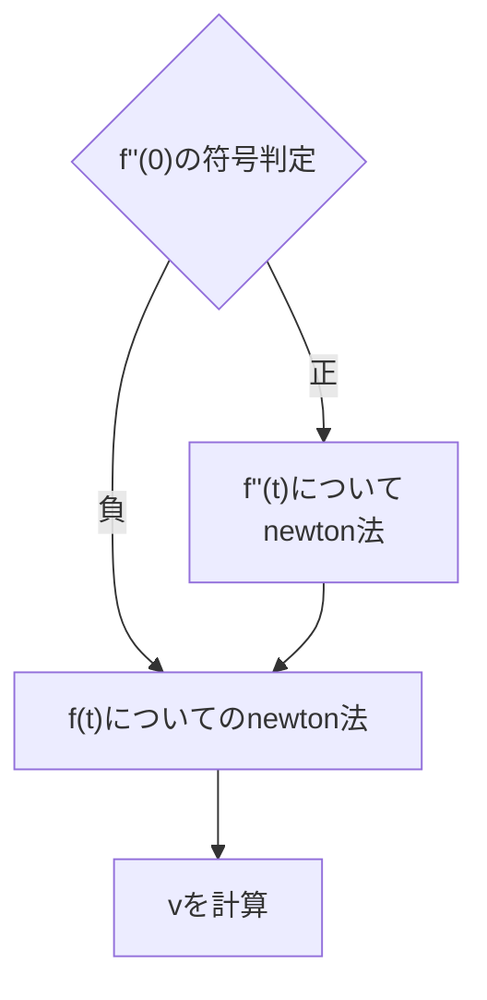

## この記事の内容
### 山なりの弾道を描く矢で当てたい！
　minecraftのコマンドで遊ぶ人ならば、固定砲台や遠距離攻撃をする敵など、自動で何かを発射するものを作りたくなるものだ(偏見)。当て方はいろいろあって、相手に向かってまっすぐ撃つだけであったり、ホーミング(追尾)したりもできるけど、相手の動きを予測して撃つ偏差撃ちも作りたいものだと思う。以前私は、主にexecute幾何と呼ばれる手法を中心に統合版でその機構を作った。(解説：https://www.nicovideo.jp/watch/sm45658465)
　この時はtpコマンドで動くまっすぐ飛ぶ弾を使っていた。しかし、Java版ではdataコマンドを使えば矢をもっと自然に飛ばせるので、せっかくならば矢のうける重力や空気抵抗を計算に入れて当てることができないだろうか？この記事では、その手段を解説したい。

## 方針
Java版では統合版と違い`execute...store result...`でエンティティの座標をスコアボードに取り込めるので、射撃する砲台の座標と標的の座標を取り込んで、あとはとにかくスコアボードで処理していく。まず標的の何tick後の位置を狙えばよいかをnewton法を使って計算する。次に、その位置を狙えるような方向(初速ベクトル)を計算する。ボリュームは何tick後の位置を狙うかが大部分を占めていて、その後はおまけに近い。
もう少し具体的な計算を手短にまとめると、
```math
f(t)=(v^2-25)(100(1-e^{-0.01t}))^2+1000(\beta_yt+\alpha_y)(1-e^{-0.01t})-|\vec{\beta}t+\vec{\alpha}|^2
```
の根をnewton法で求め、得られた$t$を
```math
\vec{v}=\frac{\vec{\alpha}+\vec{\beta}t}{100(1-e^{-0.01t})}-5\vec{e}_y
```
という式に代入して終了。導出の項以下でもう少し詳しく説明するが、大学数学も出てくる内容になるのでご容赦を。ただ、高校数学範囲の知識でもほとんど理解できるように心掛ける。
## 導出
取り敢えず、標的は等速直線運動を仮定しておく。ここを等加速度運動とかにできれば性能も上がりそうだが、またあとで。
このとき、標的の位置ベクトルは、標的の発射時の位置とその1tick前の位置をそれぞれ$\vec{r}_a,\vec{r}_b$のように書くと、発射から$t$[tick]後の標的の位置$\vec{s}(t)$は
```math
\vec{s}(t)=\vec{r}_a+(\vec{r}_a-\vec{r}_b)t
```
のように表せる。$\vec{r}_a-\vec{r}_b$のところは速度ベクトルを表している。
また、wiki (https://ja.minecraft.wiki/w/%E7%9F%A2) によると 
> 矢は発射すると、重力により20m/秒2の加速度を受け、空気抵抗により毎ティック1%ずつ減速しながら放物運動する。

とのこと。
ここから、$\vec{r}(t)$を発射して$t$[tick]後の矢の位置ベクトルとして、矢についての運動方程式は
```math
\frac{d^2\vec{r}}{dt^2}(t)=-0.01\frac{d\vec{r}}{dt}-0.05\vec{e}_y
```
右辺の第一項は空気抵抗、第二項は重力を表す。
これをラプラス変換を用いて解くと、矢の初速ベクトルを$\vec{v}$として
```math
\vec{r}(t)=\vec{r}+100(\vec{v}+5\vec{e}_y)(1-e^{-0.01t})-5t\vec{e}_y
```
はい、大学の内容はここまで。ここからは高校数学。
ここまでで矢の発射から$t$[tick]後の矢の位置$\vec{r}(t)$,標的の位置$\vec{s}(t)$を書くことができた。
ここで、矢が命中する時
```math
\vec{r}(t)-\vec{s}(t)=\vec{0}
```
すなわち
```math
\vec{r}+100(\vec{v}+5\vec{e}_y)(1-e^{-0.01t})-5t\vec{e}_y-(\vec{r}_a+(\vec{r}_a-\vec{r}_b)t)=\vec{0}
```
ここで、$\vec{\alpha}=\vec{r}_a-\vec{r},\vec{\beta}=\vec{r}_a-\vec{r}_b+5\vec{e}_y$と置くと
```math
100(\vec{v}+5\vec{e}_y)(1-e^{-0.01t})-(\vec{\alpha}+\vec{\beta}t)=\vec{0}
```
求めたいのは発射方向$\vec{v}$であるから、これについて解くと
```math
\vec{v}=\frac{\vec{\alpha}+\vec{\beta}t}{100(1-e^{-0.01t})}-5\vec{e}_y
```
命中時の$t$が分かればこの式に代入することで撃つべき方向$\vec{v}$が求まることになる。
さてその$t$の情報が欲しい。初速$\vec{v}$の大きさは一定であり、その大きさを$v$として[^fir]
```math
|\vec{v}|=v
```
```math
|\vec{v}|^2=|\frac{\vec{\alpha}+\vec{\beta}t}{100(1-e^{-0.01t})}-5\vec{e}_y|^2=v^2
```
展開して整理すると
```math
(v^2-25)(100(1-e^{-0.01t}))^2+1000(\vec{\beta}t+\vec{\alpha})\cdot\vec{e}_y(1-e^{-0.01t})-|\vec{\beta}t+\vec{\alpha}|^2=0
```
この式の左辺を$f(t)$とする。$f(t)$が正の根$t'$を持つとき、$t'$ tick後に標的に命中するような大きさ$v$の初速$\vec{v'}$があることが分かる。すなわち、$f(t)$の正の根のうち最小のものこそが求める$t$である。


その根を求める方法だが、newton法を図のように2段階で使う。というのも、newton法を使うためには適切な初期値を使う必要があるからで、$f''(t)$のnewton法を通して適切な初期値から$f(t)$のnewton法を始めることができる。
<details><summary> f''(t)のnewton法を行う理由をもう少し丁寧に説明すると</summary>

まず$f(t)$にnewton法が使えるのか、どのような初期値であれば使えるのか調べるために$f(t)$の導関数たちから$f(t)$のグラフがどのようになるか考える。
<details><summary>memo:f(t)の導関数</summary>

```math
f(t)=(v^2-25)(100(1-e^{-0.01t}))^2+1000(\beta_yt+\alpha_y)(1-e^{-0.01t})-|\vec{\beta}t+\vec{\alpha}|^2\\
=100(1-e^{-0.01t})((v^2-25)\times100(1-e^{-0.01t})+10(\beta_yt+\alpha_y))-|\vec{\beta}t+\vec{\alpha}|^2
```

```math
f'(t)=-200(v^2-25)e^{-0.02t}+10\beta_yte^{-0.01t}+(200(v^2-25)+10\alpha_y-1000\beta_y)e^{-0.01t}-2|\vec{\beta}|^2t+1000\beta_y-2\vec{\alpha}\cdot\vec{\beta}
```

```math
f''(t)=4(v^2-25)e^{-0.02t}-0.1\beta_yte^{-0.01t}+(20\beta_y-2(v^2-25)-0.1\alpha_y)e^{-0.01t}-2|\vec{\beta}|^2
```

```math
f'''(t)=e^{-0.01t}(-0.08(v^2-25)e^{-0.01t}+0.001\beta_yt-0.3\beta_y+0.02(v^2-25)+0.001\alpha_y)
```
</details>

```math
f'''(t)=e^{-0.01t}(-0.08(v^2-25)e^{-0.01t}+0.001\beta_yt-0.3\beta_y+0.02(v^2-25)+0.001\alpha_y)=e^{-0.01t}g(t)
```
と$g(t)$を置くと
```math
g(t)=-0.08(v^2-25)e^{-0.01t}+0.001\beta_yt-0.3\beta_y+0.02(v^2-25)+0.001\alpha_y
```
```math
g'(t)=0.0008(v^2-25)e^{-0.01t}+0.001\beta_y,g''(t)=-8\times10^{-6}\times(v^2-25)e^{-0.01t}<0
```
$v>5$ とすれば$g'(t)$は単調減少で、(i)常に正または(ii)根を一つ持つ。

(i)$g'(t)$>0 すなわち$\beta_y\ge0$のとき、$g(t)$は単調増加であり、根を一つだけ持つ。これに指数関数(常に正)をかけた$f'''(t)$も当然根を一つだけ持つ。その根を$t_a$として、

$t$|...|$t_a$|...|$\infty$|
:--:|:--:|:--:|:--:|:--:|
$f'''(t)$|-|0|+|0
$f''(t)$|$\searrow$||$\nearrow$|$-2\|\vec{\beta}\|^2$|

よって、この場合$f''(t)$は$t<t_a$の範囲に根を一つだけ持つ。

(ii)$g'(t)$は根を一つ持つ、すなわち$\beta_y<0$のとき、その根を$t_b$として
$t$|...|$t_b$|...
:--:|:--:|:--:|:--:
$g'(t)$|+|0|-
$g(t)$|$\nearrow$||$\searrow$

ここで、(ii-i)$g(t)\le0$すなわち$g(t_b)\le0$,または(ii-ii)$g(t)$は根を二つ持つ。

(ii-i)$g(t)\le0$すなわち$g(t_b)\le0$のときこれに指数関数(常に正)をかけた$f'''(t)$についても当然$f'''(t)\le0$が成立。
$t$|...|$\infty$
:--:|:--:|:--:
$f'''(t)$|-|0
$f''(t)$|$\searrow$|$-2\|\vec{\beta}\|^2$

この場合も$f''(t)$は根を一つだけ持つことが分かる。

(ii-ii)$g(t)$が根を二つ持つとき、これに指数関数(常に正)をかけた$f'''(t)$についても当然その二個の根を持つ。その根を$t_c,t_d$として
$t$|...|$t_c$|...|$t_d$|...|$\infty$
:--:|:--:|:--:|:--:|:--:|:--:|:--:
$f'''(t)$|-|0|+|0|-|0
$f''(t)$|$\searrow$||$\nearrow$||$\searrow$|$-2\|\vec{\beta}\|^2$

ここで$v$がある値以上のときにおいて、$f''(t)$ が根をただ一つ持つ、すなわち$f''(t_d)\le0$である。

<details><summary>証明</summary>

$t_d$は$g(t)$の根であったから、
```math
g(t_d)=-0.08(v^2-25)e^{-0.01t_d}+0.001\beta_yt_d-0.3\beta_y+0.02(v^2-25)+0.001\alpha_y=0
```
これを変形して
```math
\alpha_y=80(v^2-25)e^{-0.01t_d}-\beta_yt_d+300\beta_y-20(v^2-25)
```
これを$f''(t_d)$に入れると
```math
f''(t_d)=4(v^2-25)e^{-0.02t_d}-0.1\beta_yt_de^{-0.01t_d}+(20\beta_y-2(v^2-25)-0.1(80(v^2-25)e^{-0.01t_d}-\beta_yt_d+300\beta_y-20(v^2-25)))e^{-0.01t_d}-2|\vec{\beta}|^2=-4(v^2-25)e^{-0.02t_d}-10\beta_ye^{-0.01t_d}-2|\vec{\beta}|^2
```
```math
f''(t_d)=-(4(v^2-25)e^{-0.01t_d}+10\beta_y)e^{-0.01t_d}-2|\vec{\beta}|^2
```
であるが、ここで$4(v^2-25)e^{-0.01t_d}+10\beta_y\ge0$の時明らかに$f''(t_d)<0$であるから$$4(v^2-25)e^{-0.01t_d}+10\beta_y\le0$$の時を考える。この時$$e^{-0.01t_d}\le\frac{-10\beta_y}{4(v^2-25)}$$よって$$f''(t)\le-(4(v^2-25)e^{-0.01t_d}+10\beta_y)\frac{-10\beta_y}{4(v^2-25)}-2|\vec{\beta}|^2=10\beta_ye^{-0.01t_d}+\frac{100\beta_y^2}{4(v^2-25)}-2|\vec{\beta}|^2$$ここで(ii)は$\beta_y<0$を考えているので、$$f''(t_d)<\frac{100\beta_y^2}{4(v^2-25)}-2|\vec{\beta}|^2\le\frac{25\beta_y^2}{v^2-25}-2\beta_y^2=(\frac{25}{v^2-25}-2)\beta_y^2$$
よって、$\frac{25}{v^2-25}-2\le0$すなわち$v\ge5\sqrt{3/2}$のとき$f''(t_d)<0$が成立する。($v>5$を使っている。)
</details>

(i)(ii)を通して$v\ge5\sqrt{3/2}$のとき$f''(t)$は必ず根を一つだけ持つことが分かったので、
$t$|$-\infty$|...|$t_e$|...|$\infty$
:--:|:--:|:--:|:--:|:--:|:--:
$f''(t)$||+|0|-|
$f'(t)$|$-\infty$|$\nearrow$||$\searrow$|$-\infty$

すると$f'(t_e)$の符号によって(I)$f'(t)\le0$または(II)$f'(t)$は根を二つ持つ。(I)のとき$f(t)$は単調減少、(II)のときは次のようになる。

$t$|...|$t_f$|...|$t_g$|...
:--:|:--:|:--:|:--:|:--:|:--:
$f'(t)$|-|0|+|0|-
$f(t)$|$\searrow$||$\nearrow$||$\searrow$

ここまでの長い道のりを経て、実数全ての範囲の$t$で$f(t)$の動きが分かってきた。
これに加えて、$f(0)=-|\vec{\alpha}|^2\le0$であること、また求める$\vec{v}$が存在する時には$f(t)$は正の根を持つことを考えると、矢を当てられる時$f(t)$は単調減少にはならず(単調減少では正の根を持てないため)、$t>0$での$f(t)$の増減は次の2通りが考えられる。

$t$|0|...|$t_g$|...
:--:|:--:|:--:|:--:|:--:
$f(t)$|負|$\nearrow$|正|$\searrow$

或いは

$t$|0|...|$t_f$|...|$t_g$|...
:--:|:--:|:--:|:--:|:--:|:--:|:--:
$f(t)$|負|$\searrow$|負|$\nearrow$|正|$\searrow$

2つの内どちらかになるかは$\vec{\alpha},\vec{\beta}$次第、つまり実際に射撃するときの状況次第。

$f''(t)$の持つただ一つの根$t_e$について$t_f<t_e<t_g$で、更に求めたい解$t^*$($f(t)$の正の根の内最小のもの)について$t_f<t^*<t_g$であることに注意すると$t_e$からnewton法を使えばが$t^*$得られる。

<details><summary>証明</summary>

(1) $t^*\le t_e$のとき、区間$[t^*,t_e]$では$f''(t)\ge0,f'(t)>0,f(t)\ge0$が成立する。よって
$$t\ge t-\frac{f(t)}{f'(t)}$$
また$t^*\le \tau \le t \le t_e$のとき$f''(t)\ge0$より$f'(\tau)\le f'(t)$
$$\int_{t^*}^tf'(\tau)d\tau\le\int_{t^*}^tf'(t)d\tau$$
より$f(t)-f(t^*)\le f'(t)(t-t^*)$

更に$f(t^*)=0$より$f(t)\le f'(t)(t-t^*)$

これを変形して$$t^*\le t-\frac{f(t)}{f'(t)}$$
よって$$t^*\le t-\frac{f(t)}{f'(t)}\le t$$であるから、数列
$$t_{n+1}=t_n-\frac{f(t_n)}{f'(t_n)},t_0\in [t^*,t_e]$$
は下に有界な単調減少数列となるため収束する。

(2) $t_e\le t^*$のとき、区間$[t_e,t^*]$では$f''(t)\le0,f'(t)>0,f(t)\le0$が成立する。よって
$$t\le t-\frac{f(t)}{f'(t)}$$
また$t_e\le t \le \tau \le t^*$のとき$f''(t)\le0$より$f'(\tau)\le f'(t)$
$$\int_t^{t^*}f'(\tau)d\tau\le\int_t^{t^*}f'(t)d\tau$$
より$f(t^*)-f(t)\le f'(t)(t^*-t)$

更に$f(t^*)=0$より$-f(t)\le f'(t)(t^*-t)$

これを変形して$$t^*\ge t-\frac{f(t)}{f'(t)}$$
よって$$t\le t-\frac{f(t)}{f'(t)}\le t^*$$であるから、数列
$$t_{n+1}=t_n-\frac{f(t_n)}{f'(t_n)},t_0\in [t_e,t^*]$$
は上に有界な単調増加数列となるため収束する。

また、$$t_{n+1}=t_n-\frac{f(t_n)}{f'(t_n)}$$を満たす数列が収束するとき、その収束値$t_{lim}$として
$$\lim_{n\to\infty}t_n=t_{lim},\lim_{n\to\infty}t_{n+1}=\lim_{n\to\infty}(t_n-\frac{f(t_n)}{f'(t_n)})=t_{lim}-\frac{f(t_{lim})}{f'(t_{lim})}$$

$$\therefore t_{lim}=t_{lim}-\frac{f(t_{lim})}{f'(t_{lim})}$$
より$f(t_{lim})=0$であるから、(1)(2)の場合は$t^*$に収束する。
</details>

そして、増減表から$t_e>0$のとき区間[0,t_e]分かる
また、同様に$t_e\le0$のとき$t=0$からnewton法を使っても良い。
</details>




<details><summary>expの計算方法</summary>

expをスコアボードの整数演算でどのように計算すればよいか考える。
前提として、 ~~tは100倍した状態で保持され、expも100倍したものを出力しようと考えている。即ち、tもexpも誤差が1/100以下ならば精度として十分であると考えている。~~ 全然精度が足りていないので有効桁数を増やさなければならない。
次式のテーラー近似を用いる。
```math
e^{t}=\sum_{n=0}^{\infty}\frac{t^n}{n!} \approx \sum_{n=0}^{10}\frac{t^n}{n!}
```
即ち、
```math
e^{-0.01t}\approx \sum_{n=0}^{10}\frac{(-1)^n}{n!} (\frac{t}{100})^n
```
ここで、スコアtに実際に入る値100tをTとおくと
```math
e^{-0.01t}=e^{-T\times 10^{-4}}\approx \sum_{n=0}^{10}\frac{(-1)^n}{n!} (T\times10^{-4})^n
```
```math
e^{-T\times 10^{-4}}\times10^4\approx \sum_{n=0}^{10}\frac{(-1)^n}{n!} T^n(10^{-4})^{n-1}=10^4-T+\frac{T^2}{2\times10^4}-\frac{T^3}{3!\times(10^4)^2}+...
```
ここでT^nが問題になるわけである。ここの精度を考える必要がある。Tは高々数万程度の値であり、直接二乗してもスコアはオーバーフローしないようになっている。ここで、次の数列を考える。
```math
T_1=T,T_2=T_1^2/(2\times10^4),T_3=T_1T_2/(3\times10^4),T_4=T_1T_3/(4\times10^4),...
```
これは少なくとも、T<20000であればオーバーフローすることはない。ただしここでは"/"は整数演算としての除算である。さて、この数列には
```math
T_n=\frac{T^n}{n!\times(10^4)^{n-1}}
```
となってほしい。ただし、expは誤差が1/100以下ならば精度として十分であるから、Tnの誤差の和は100を下回ればよい。
まず、n=2の誤差を考える。
```math
\Delta T_2=\frac{T^2}{2\times10^4}-T_1^2/(2\times10^4)=\frac{T^2\%(2\times10^4)}{2\times10^4}<1
```
次に、n=3
```math
\Delta T_3=\frac{T^3}{3!\times(10^4)^2}-T_1T_2/(3\times10^4)=\frac{T^3}{3!\times(10^4)^2}-T_1(\frac{T^2}{2\times10^4}-\Delta T_2)/(3\times10^4)\\=\frac{T^3}{3!\times(10^4)^2}-(\frac{T^3(2\times10^4)^{-1}-T\Delta T_2}{3\times10^4}-\frac{(T^3(2\times10^4)^{-1}-T\Delta T_2)\%(3\times10^4)}{3\times10^4})\\=\frac{T\Delta T_2+(T^3(2\times10^4)^{-1}-T\Delta T_2)\%(3\times10^4)}{3\times10^4}
```
n>2では
```math
\Delta T_n=\frac{T^n}{n!\times(10^4)^{n-1}}-T_n=\frac{T^n}{n!\times(10^4)^{n-1}}-T_1T_{n-1}/(n\times10^4)=\frac{T^n}{n!\times(10^4)^{n-1}}-T_1T_{n-1}/(n\times10^4)\\=\frac{T^n}{n!\times(10^4)^{n-1}}-T_1(\frac{T^{n-1}}{(n-1)!\times(10^4)^{n-2}}-\Delta T_{n-1})/(n\times10^4)\\=\frac{T^n}{n!\times(10^4)^{n-1}}-\frac{T^n((n-1)!\times(10^4)^{n-2})^{-1} -T\Delta T_{n-1}-(T^n((n-1)!\times(10^4)^{n-2})^{-1} -T\Delta T_{n-1})\%(n\times10^4)}{(n\times10^4)}\\=\frac{T\Delta T_{n-1}+(T^n((n-1)!\times(10^4)^{n-2})^{-1} -T\Delta T_{n-1})\%(n\times10^4)}{(n\times10^4)}<\frac{2\Delta T_{n-1}}{n}+1 \because T<20000
```
よって
```math
\Delta T_2<1,\Delta T_3<\frac{5}{3},\Delta T_4<\frac{11}{6}\\n>3,\Delta T_{n-1}<2\ \Rightarrow\Delta T_n<\frac{2\Delta T_{n-1}}{n}+1<2\\n>3\Rightarrow\Delta T_n<2\because \Delta T_4<2\\\sum_{n=0}^{10}\Delta T_n=\sum_{n=2}^{10}\Delta T_n<\frac{8}{3}+\sum_{n=4}^{10}\Delta T_n<\frac{8}{3}+14
```
ここまでで、
```math
100e^{-0.01t}\approx100+(\sum_{n=1}^{10}(-1)^nT_n)/100
```
として計算できることが分かった。
</details>

<details><summary>memo:内積の高精度計算</summary>

2つのベクトルα,βがそれぞれn倍されてスコアに格納されている状態を考える。このとき、
```math
\frac{n\vec{\alpha}\cdot n\vec{\beta}}{k}=n\vec{\alpha}\cdot \frac{n\vec{\beta}}k=n\vec{\alpha}\cdot(n\vec{\beta}/k+\frac{n\vec{\beta}\%k}{k})\\=n\vec{\alpha}\cdot (n\vec{\beta}/k)+\frac{n\vec{\alpha}\cdot (n\vec{\beta}\%k)}{k}=n\vec{\alpha}\cdot (n\vec{\beta}/k)+\frac{n\vec{\alpha}}{k}\cdot (n\vec{\beta}\%k)\\=n\vec{\alpha}\cdot (n\vec{\beta}/k)+(n\vec{\alpha}/k+\frac{n\vec{\alpha}\%k}{k})\cdot (n\vec{\beta}\%k)
```
或いは、k=k1k2として
```math
\frac{n\vec{\alpha}\cdot n\vec{\beta}}{k}=\frac{n\vec{\alpha}\cdot n\vec{\beta}}{k_1k_2}=(n\vec{\alpha}/k_1+\frac{n\vec{\alpha}\%k_1}{k_1})\cdot(n\vec{\beta}/k_2+\frac{n\vec{\beta}\%k_2}{k_2})
```
</details>

ここまででf(t)=0となるtの近似値が求まったので、
```math
\vec{v}=\frac{\vec{\alpha}+\vec{\beta}t}{100(1-e^{-0.01t})}-5\vec{e}_y
```
を基に計算してやればよい！
<details><summary>v計算部の割り算について</summary>

```math
v_x=(100a)/b
```
で、分子がそのままではオーバーフローする状況で計算する。
```math
(100a)/b=((100a)/b/100)\cdot100+((100a)/b)\%100\\=(((100a)/100)/b)\cdot100+((100a)/b)\%100
```
ここで、任意の整数x,y,zについて
```math
\frac{x}{yz}=\frac{x/y+\frac{x\%y}{y}}{z}=(x/y)/z+\frac{(x/y)\%z}{z}+\frac{x\%y}{yz}\\
x=((x/y)/z)yz+y\cdot(x/y)\%z+x\%y\\
\therefore (x/y)/z=x/(yz),y\cdot(x/y)\%z+x\%y=x\%(yz)\\
\because 0<=y\cdot(x/y)\%z+x\%y<yz (y>0,z>0)\\
\therefore y\cdot(x/y)\%z+x\%y=z\cdot(x/z)\%y+x\%z
```
</details>

## 終わりに
ここまで読んでいただきありがとうございました。質問やツッコミどころ、アドバイス等あれば是非教えて下さい。

[^fir]: 簡単のため、矢が本体の中心(回転軸)から発射される前提の式になっているが、発射位置が前後にずれていても比較的簡単に補正することができる。例えば、1ブロック前から発射する場合は仮想的に1/$v$tick前の状態で中心から発射すると考えることで、この中心と発射位置とのずれを補正することが出来る。